<p align="center">
  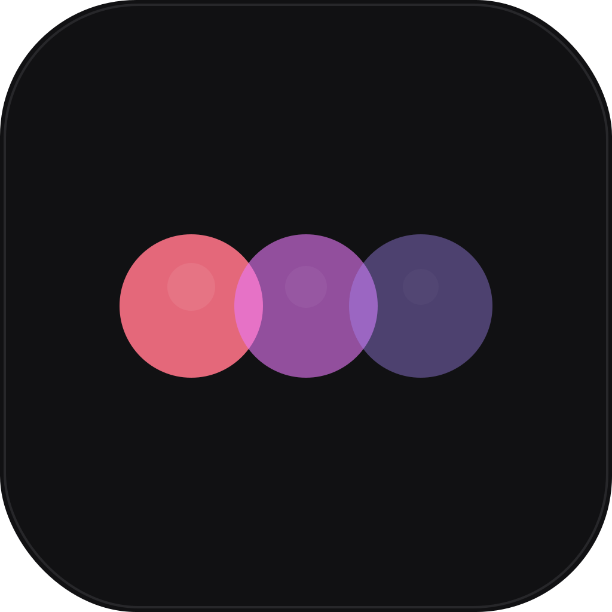
</p>

<h1 align="center">ClaudeHub</h1>

<p align="center">
  <strong>Visual dashboard for managing your entire Claude Code configuration.</strong><br />
  Skills, Plugins, MCP Servers, Memory, CLAUDE.md — all in one place.
</p>

<p align="center">
  
  
  
  
</p>

---

## What is ClaudHub?

Claude Code stores configuration across dozens of files — `settings.json`, `CLAUDE.md`, skills, plugins, hooks, MCP servers, memory, session logs, and more. Managing all of these by hand is tedious and error-prone.

**ClaudHub** gives you a single visual interface to see, edit, and manage everything in your `~/.claude/` directory. No more guessing what's configured where.

---

## Core Features

### Dashboard

At a glance, see the full picture of your Claude Code environment.

<p align="center">
  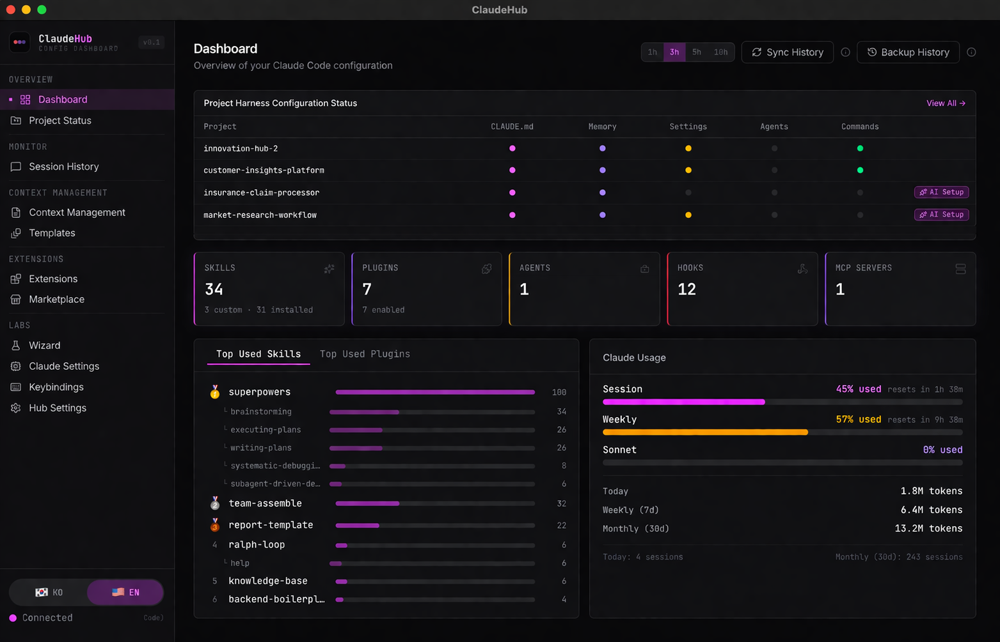
</p>

- **Project Harness Status** — See which projects have CLAUDE.md, Memory, Settings, Agents, and Commands configured. Spot gaps instantly and launch AI Setup for incomplete projects.
- **Extension Summary** — Total count of Skills, Plugins, Agents, Hooks, and MCP Servers across your environment.
- **Top Used Skills & Plugins** — Ranked by actual usage frequency. Identify which tools are driving your workflow.
- **Claude Usage** — Real-time rate limit monitoring (Session / Weekly / Sonnet), token consumption (Today / Weekly / Monthly), and session counts.
- **Auto-refresh** — Configurable interval (1m / 3m / 5m / 10m) with manual Sync and Backup History controls.

---

### Project Status

Browse all your Claude Code projects and inspect their harness configuration in detail.

<p align="center">
  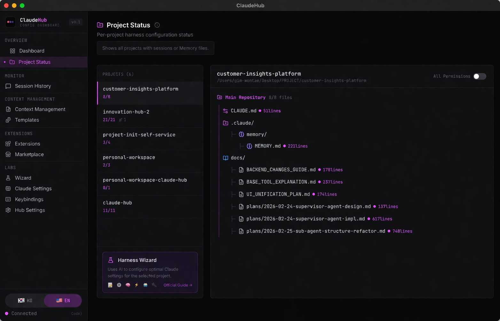
</p>

- **Project List** — All projects with session or memory files, showing file count and worktree indicators.
- **File Tree** — Expand any project to see CLAUDE.md, memory files, docs, and plans with line counts.
- **Permission Toggle** — Enable or disable all permissions per project.
- **Harness Wizard Shortcut** — Launch AI-powered configuration directly from the project view.

---

### Harness Wizard

Automatically generate optimal Claude Code settings for any project using AI.

<p align="center">
  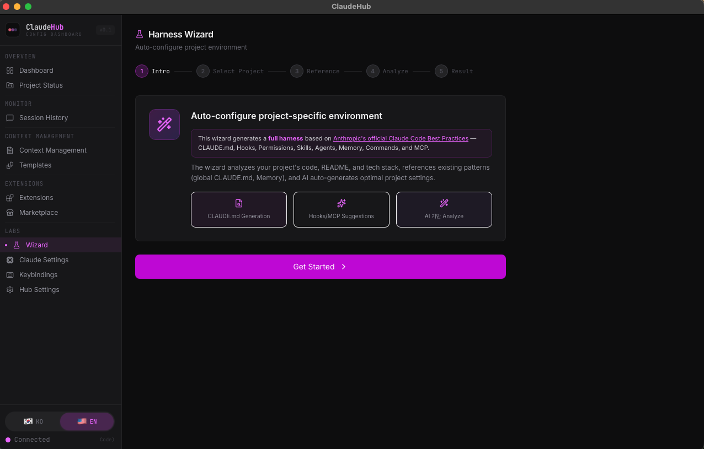
</p>

- **AI-Powered Analysis** — Scans your project's code, README, and tech stack, then generates a complete harness configuration based on [Anthropic's Official Best Practices](https://docs.anthropic.com/en/docs/claude-code/best-practices).
- **Full Harness Generation** — Creates CLAUDE.md, Hooks, Permissions, Skills, Agents, Commands, Memory, and MCP configurations in one pass.
- **Step-by-Step Flow** — Intro → Select Project → Reference Settings → Analyze → Result. Review and apply with confidence.
- **Reference-Aware** — References your global CLAUDE.md and Memory to maintain consistency across projects.

<p align="center">
  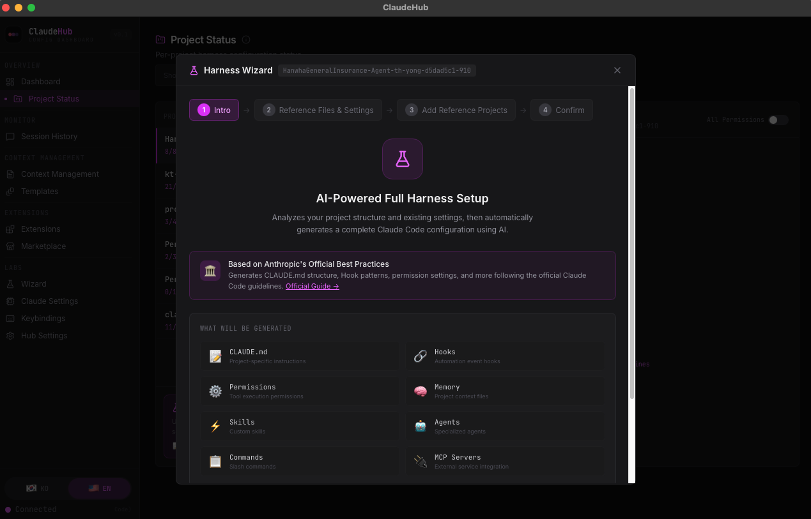
  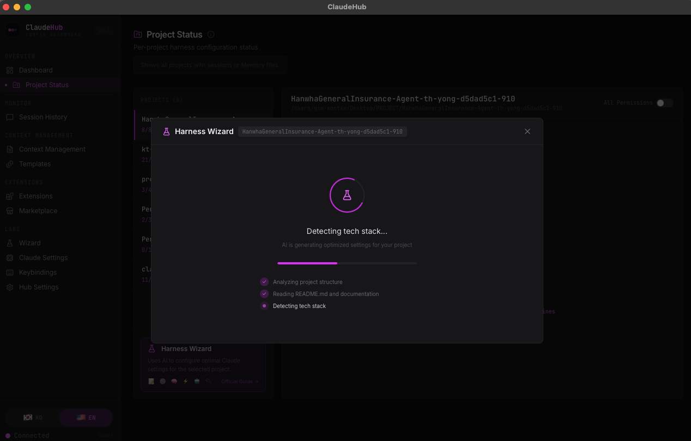
</p>

---

### Session History

Browse all Claude Code conversation histories with a chat-style viewer.

<p align="center">
  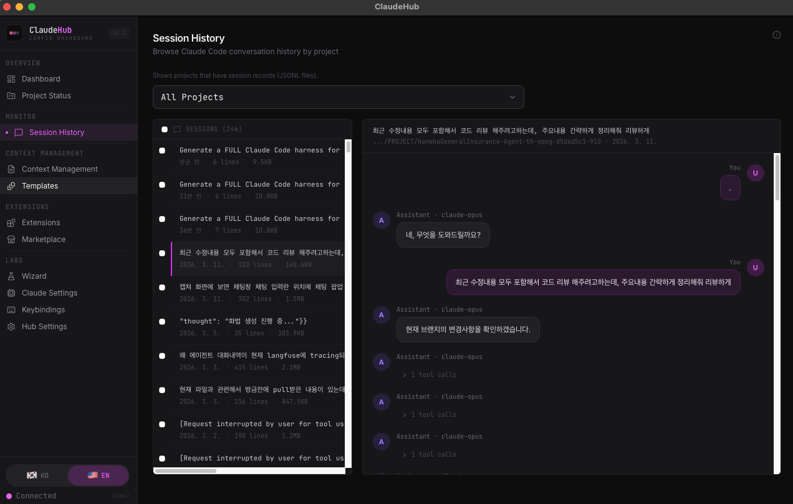
</p>

- **Project Filter** — Browse sessions across all projects or filter by specific project.
- **Chat-Style Viewer** — Read conversations in a familiar message bubble format with tool call indicators.
- **Session Metadata** — See line count, file size, and timestamps for each session.
- **Bulk Management** — Select and delete multiple sessions at once.

---

## More Features

### Context Management

Edit your CLAUDE.md and Memory files with a full-featured code editor.

<p align="center">
  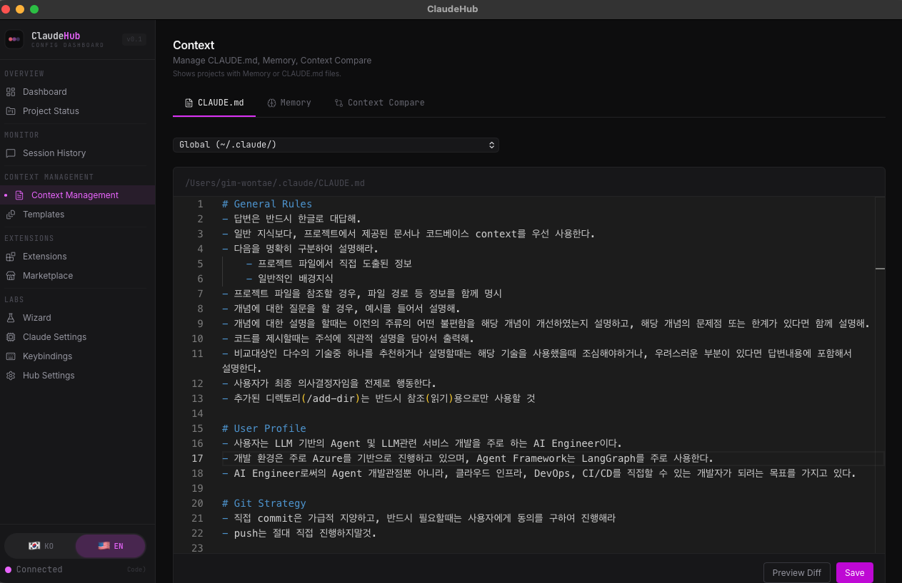
</p>

- **Monaco Editor** — Syntax-highlighted editing for CLAUDE.md with line numbers.
- **Scope Selector** — Switch between Global (`~/.claude/`) and per-project configurations.
- **Memory Browser** — View and edit project memory files (MEMORY.md, feedback, fixes).
- **Context Compare** — Diff two projects' configurations side by side and sync with one click.
- **Preview Diff** — Review changes before saving. Automatic backup on every write.

---

### Extensions

Manage Skills, Plugins, Agents, Hooks, and MCP Servers from a single unified view.

<p align="center">
  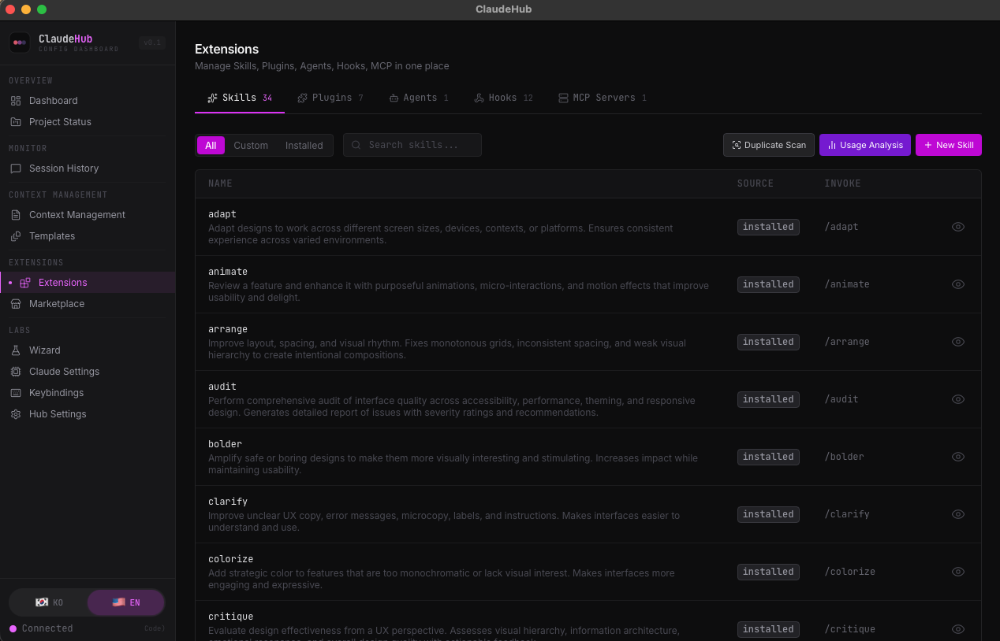
</p>

- **Skills** — Browse all installed skills with descriptions and invoke commands. Create custom skills with AI-powered similarity check on creation.
- **Plugins** — Toggle, install, and remove plugins.
- **Agents** — View and edit agent definitions.
- **Hooks** — Visual editor for all 11 event types.
- **MCP Servers** — Configure servers with masked environment variables.
- **Usage Analysis** — AI-powered ranking of extension usefulness based on actual usage patterns.

#### Duplicate Scan & Merge

Detect and resolve duplicate skills using Claude AI-powered 4-dimension analysis.

<p align="center">
  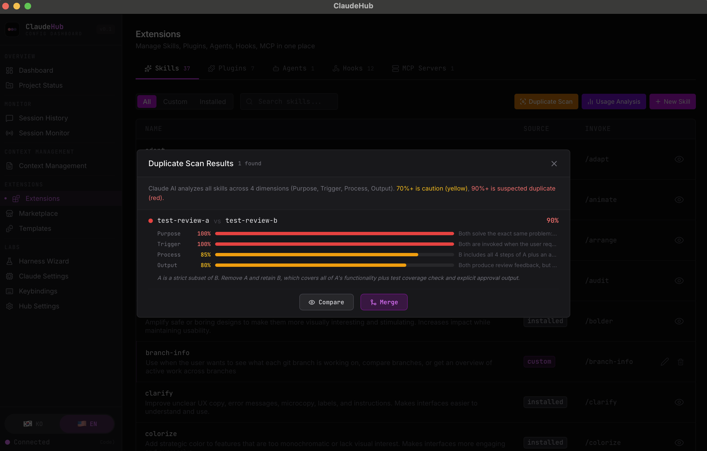
</p>

- **4-Dimension AI Analysis** — Claude evaluates every skill pair across Purpose, Trigger, Process, and Output similarity. Goes beyond text matching to understand semantic overlap.
- **Visual Scoring** — Each dimension shown as a color-coded progress bar (red: 90%+, yellow: 70%+) with inline reasoning.
- **Smart Merge** — Select a target name (Skill A, Skill B, or new), preview the merged result with source highlighting, edit in Monaco Editor, then confirm.
- **Auto-Skip** — After merging or deleting a skill, all remaining pairs involving that skill are automatically filtered out.
- **Similarity Check on Create** — When creating a new skill, the system warns if similar skills already exist and offers to merge instead.

---

### Marketplace

Discover and install plugins and MCP servers from the community.

<p align="center">
  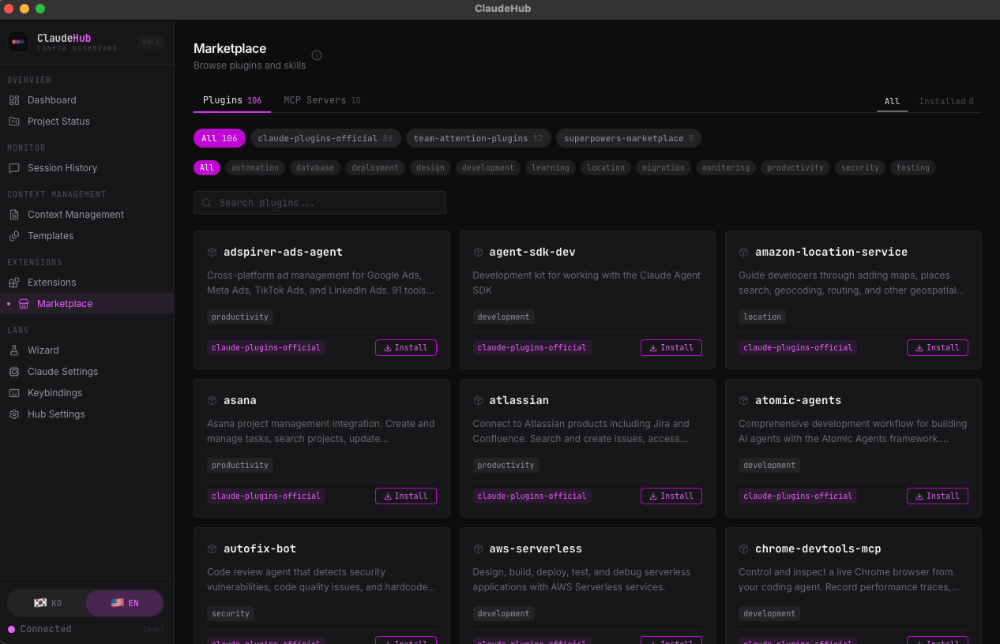
</p>

- **Plugin Directory** — Browse 100+ plugins from official and community sources.
- **MCP Servers** — Install MCP servers with automatic `settings.json` configuration.
- **Category Filters** — Filter by automation, database, deployment, design, development, and more.
- **One-Click Install/Uninstall** — No manual JSON editing required.

---

### Templates

Apply pre-built harness configurations to any project with one click.

<p align="center">
  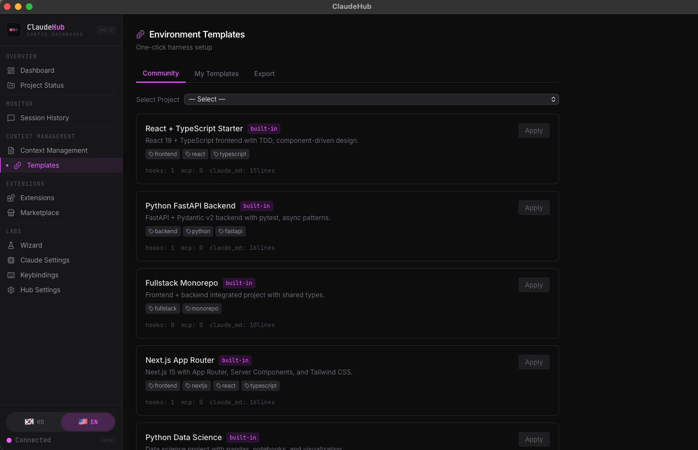
</p>

- **Community Templates** — Built-in presets for React, FastAPI, Next.js, Monorepo, Data Science, and more.
- **My Templates** — Export your own project configurations as reusable templates.
- **Template Details** — See hooks, MCP servers, and CLAUDE.md line counts before applying.

---

## Installation

### Homebrew (macOS, recommended)

```bash
brew tap WontaeKim89/tap && brew install claude-hub
```

This installs the CLI and automatically creates **ClaudeHub.app** in `/Applications`.

**Launch:**

```bash
claude-hub                    # Opens native app window (pywebview)
```

Or open **Finder → Applications → ClaudeHub**, or drag it to your Dock for quick access.

**Update:**

```bash
brew update && brew upgrade claude-hub
```

Or click the **Update** banner in the Dashboard when a new version is available.

### PyPI

```bash
uvx claude-hub          # one-shot run (no install)
# or
pip install claude-hub   # permanent install
claude-hub
```

### From Source (for development)

```bash
git clone https://github.com/WontaeKim89/claude-hub.git
cd claude-hub
bash scripts/build.sh   # Build frontend
uv run claude-hub        # Start server
```

Opens at **http://localhost:3847**

### Prerequisites

- **[Claude Code](https://claude.ai/code)** installed and authenticated
- **Python 3.13+** and **[uv](https://docs.astral.sh/uv/)** (auto-installed by Homebrew)

---

## Tech Stack

| Layer | Technology |
|-------|-----------|
| Backend | Python 3.13 / FastAPI / Pydantic v2 / uvicorn |
| Frontend | Vite + React 19 + Tailwind CSS v4 + Monaco Editor |
| Database | SQLite (usage statistics) |
| Packaging | PyPI (uv build) |
| macOS App | pywebview native window |

---

## Design Principles

- **Local-only** — Binds to `127.0.0.1`. Your config never leaves your machine.
- **Non-destructive** — Automatic backup before every write operation.
- **Conflict-safe** — mtime-based optimistic locking (409 on concurrent edits).
- **Zero config** — Reads `~/.claude/` filesystem directly, no setup required.
- **Bilingual** — KO/EN language support.

---

## Development

```bash
# Backend (auto-reload)
uv run uvicorn claude_hub.main:create_app --factory --reload --port 3847

# Frontend (dev server with HMR)
cd src/client && npm run dev

# Tests
uv run pytest tests/ -v
```

---

## Contributing

Contributions are welcome! Please feel free to submit a Pull Request.

1. Fork the repository
2. Create your feature branch (`git checkout -b feature/amazing-feature`)
3. Commit your changes
4. Push to the branch
5. Open a Pull Request

---

## License

MIT License. See [LICENSE](LICENSE) for details.
